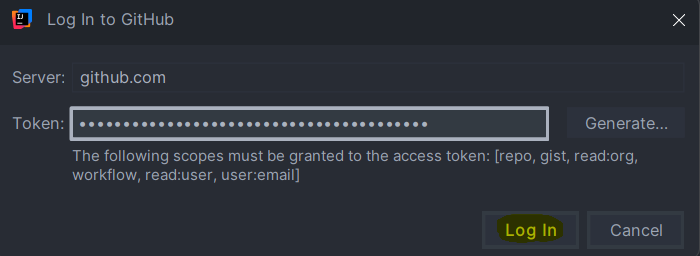

---
title: "Git Basics mit IntelliJ"
---

# Git

## Einführung

Git ist das weltweit am meisten genutzte Versionsverwaltungssystem, auf englisch  **Version Control System (VCS)**. Es wird von Einzelpersonen, Open-Source-Projekten und Unternehmen aller Größen eingesetzt. Kenntnisse in Git werden für Softwareentwickler*innen als Standard vorausgesetzt.

Die Grundidee eines VCS ist, den **Zustand eines Projekts** immer wieder zu **speichern/einfrieren**. So kann man nachverfolgen, wer welche Änderungen vorgenommen hat, jederzeit zu einer alten Version zurückkehren, Änderungen gleichzeitig vornehmen und wieder zu einem gemeinsamen Code zusammenführen (statt sich Dateien gegenseitig zu überschreiben).

Die Speicherung des aktuellen Zustands nennt man in git **Commit**. 

Ein Projekt wird in einem **Repository** (kurz: Repo) gespeichert. 

Prinzipiell speichert Git die einzelnen "Commits" eines Projekts nur lokal. Um ein Projekt auf mehreren Rechnern, bzw. im Team, zu bearbeiten, werden die Versionen auf auf einen zentralen Server übertragen. So hat man auch gleich ein Backup. Bekannte öffentliche git-Server sind z.B. [Github](https://www.github.com) oder [Gitlab](https://www.gitlab.com). Diese Plattformen stellen meist noch viele weitere Funktionen (für die Zusammenarbeit im Team, Projektmanagement, Bugtracking, ...) zur Verfügung.

## Anwendung von git in der 2. Klasse

Die Abgabe der Übungen erfolgt über ein git Repository. Jeder Schüler und jede Schülerin hat ein eigenes Repository, in dem die Lösungen für die Übungen gespeichert werden.

Die git-Repositorys werden auf [Github](https://www.github.com) gehostet.

Der Link zu deinem persönlichen Repository hat folgendes Format: `https://github.com/{schuljahr}-{klasse}-SEW/{nachname}-{vorname}`, z.B. `https://github.com/25-26-2BI-SEW/mustermann-max`.

## git in IntelliJ verwenden

### Repository klonen

Dein git-Repository wurde auf github bereits angelegt. Um es in IntelliJ zu verwenden, musst man es zuerst klonen. Gehe dazu folgendermaßen vor:

1. Öffne IntelliJ und wähle "Clone Repository" auf der Startseite oder im Menü "File" > "New" > "Project from Version Control" falls du ein Projekt geöffnet hast..

2. Sollte git auf deinem Rechner noch nicht installiert sein, wirst du jetzt darauf hingewiesen. Klicke auf "Download and Install", um git zu installieren.

3. Gehe auf die **Webseite deines Repositorys** auf github und kopiere die URL des Repositorys (grüner Button "Code" > "HTTPS"). Wichtig: Achte darauf, dass du **HTTPS** auswählst und nicht SSH.

3. Füge die URL in IntelliJ ein. Wähle einen Ordner auf deinem Computer, in dem das Repository gespeichert werden soll und klicke auf "Clone". Der lokale Ordner sollte leer sein und kann einen anderen Namen als das Repository haben.

4. Wähle als Authentifizierungsmethode "Use Token". 

5. Im folgenden Fenster klicke auf "Generate", um einen neuen Zugangstoken für IntelliJ zu erstellen.

6. Es öffnet sich die Webseite von github, auf der du dich mit deinem github-Benutzernamen und Passwort anmelden musst. Danach kannst du den Token generieren. Setze ein "Expiration Date", das **nach** Ende des Schuljahrs liegt oder wähle "No expiration". Scrolle dann zum Ende der Seite und klicke auf "Generate token".

7. Danach wird dir der Token angezeigt. **Kopiere** ihn in die Zwischenablage (**du kannst ihn später nicht mehr einsehen!**) und klicke auf "Done".

8. Füge den Token in IntelliJ ein und klicke auf "Log In".

9. Du musst das Projekt als vertrauenswürdig einstufen, dass du den Code darin ausführen kannst.

Nachdem du das Repository geklont hast, öffnet es sich in IntelliJ und du kannst mit der Arbeit an deinen Übungen beginnen. 

Dieser Schritt erfolgt **einmalig** auf jedem Rechner, auf dem du arbeitest.

### Commits - Änderungen speichern

Nach **jedem** abgeschlossenem Arbeitsschritt (z.B. eine Methode implementiert, Testaufrufe hinzugefügt) solltest du deine Änderungen in Git speichern. Dies geschieht durch einen **Commit**. Ein Commit ist wie ein Schnappschuss deines Projekts zu einem bestimmten Zeitpunkt. 

Um einen Commit in IntelliJ zu erstellen, gehe folgendermaßen vor:

1. Öffne das "Commit" Fenster in der Seitenleiste.
2. In der Liste siehst du alle Dateien, die entweder neu angelegt oder geändert wurden. Wähle die Dateien aus, die du committen möchtest. In den meisten Fällen sind das alle Dateien in der Liste.
3. Jeder Commit bekommt eine aussagekräftige Beschreibung, die erklärt, was in diesem Commit geändert wurde. Wenn du für die Beschreibung mehrere Sätze brauchst bzw. das Wort "und", ist das meist ein Zeichen, dass du dafür eigentlich mehrere einzelne Commits machen solltest. Jeder einzelne Arbeitsschritt sollte in einem eigenen Commit festgehalten werden.
4. Klicke auf den "Commit and Push" Button. Dadurch wird ein Commit erstellt ("Commit") und die Änderungen gleichzeitig auf das Remote-Repository auf github übertragen ("Push").

5. Um den Push final durchzuführen, musst du in dem sich öffnenden Fenster auf "Push" klicken.

**Wiederhole** diese Schritte nach **jedem** abgeschlossenen Arbeitsschritt.

Du kannst jederzeit die **Webseite deines Repositorys** in einem Browser öffnen, um deine Commits zu sehen. 

Nach Ende der Übungsdeadline gilt der letzte Commit auf github als Abgabe. Besteht eine Abgabe nur aus einem oder sehr wenigen Commits, wird dies als unzureichend angesehen!

### Änderungen von github auf deinen Rechner übertragen

Wenn du auf mehreren Rechnern arbeitest, musst du sicherstellen, dass du die neuesten Änderungen von GitHub zuerst auf deinen lokalen Rechner überträgst, bevor zu weiter arbeitest.

Dies geschieht durch einen **Pull**. Ein Pull holt die neuesten Änderungen aus dem Remote-Repository und integriert sie in dein lokales Repository. In IntelliJ findest sich diese Funktionalität jedoch unter **Update Project**.

Um einen **Update Project** in IntelliJ durchzuführen, gehe folgendermaßen vor:

1. Öffne das "Git" Menü in der oberen Leiste und klicke auf "Update Project".

2. Wähle im sich öffnenden Fenster die Option "Rebase aus und klicke auf "OK".

Es kann auch deine Lehrkraft Änderungen an deinem Repository vornehmen. **Führe diesen Schritt immer aus, bevor du mit neuen Änderungen beginnst**, um sicherzustellen, dass du die aktuellste Version des Codes hast.

